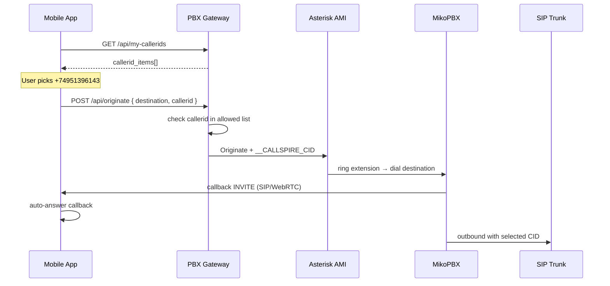

# Outbound CallerID — Android / mobile через PBX Gateway


---

## Главное

| Способ исходящего | CallerID из приложения |
|-------------------|------------------------|
| Прямой SIP/WebRTC `INVITE` на номер | **Нет** — MikoPBX применяет свои правила (user group, trunk, маршрутизация) |
| **`POST /api/originate`** с полем `callerid` | **Да** — gateway + dialplan подставляют выбранный номер |

Если звонки проходят, но CallerID «не тот» — клиент почти наверняка звонит **напрямую через SIP**, минуя originate.

---

## Правильный flow (как desktop / web)



### Шаги в коде

1. **Логин** — `POST /winapp-auth` → сохранить JWT + `extension`.
2. **Список CallerID** — `GET /api/my-callerids` → UI picker.
3. **Исходящий** — только `POST /api/originate`:

```http
POST /api/originate
Authorization: Bearer <JWT>
Content-Type: application/json

{
  "destination": "+447456875291",
  "callerid": "+74951396143",
  "ring_extension": "52678419"
}
```

4. **Callback** — PBX сначала звонит на extension пользователя; приложение **принимает** этот входящий (originate callback), затем идёт разговор с абонентом.

---

## Поля `POST /api/originate`

| Поле | Обязательно | Описание |
|------|-------------|----------|
| `destination` | да | Куда звоним (E.164 или цифры; `8977…` → `+7977…` на gateway) |
| `callerid` | да | **Выбранный** номер из `/api/my-callerids` |
| `ring_extension` | нет | Кому звонить первым; по умолчанию extension из JWT |

### `ring_extension` для mobile

| Регистрация клиента | Значение `ring_extension` |
|---------------------|---------------------------|
| Native SIP (обычный extension) | `"52678419"` или omit |
| WebRTC (`52678419-WS`) | `"52678419-WS"` |

Web softphone всегда передаёт `{extension}-WS`, чтобы callback пришёл только на WebRTC-лег, а не на параллельный desktop SIP.

---

## Ответы API

### `GET /api/my-callerids`

```json
{
  "extension": "52678419",
  "callerids": ["+74951396143", "+441156612688"],
  "callerid_items": [
    { "number": "+74951396143", "name": "Moscow" },
    { "number": "+441156612688", "name": "UK" }
  ]
}
```

Номера назначаются в **админке PBX Gateway** (PBX Users → CallerIDs для extension). Если список пуст — originate вернёт 403 или нечего выбирать.

### `POST /api/originate` — успех

```json
{
  "success": true,
  "originate_id": "a1b2c3d4e5f6..."
}
```

`originate_id` — для корреляции с callback (заголовок `X-Callspire-Originate` в SIP, если gateway его шлёт).

### Ошибки

| HTTP | Причина |
|------|---------|
| `400` | Нет `destination` или `callerid` |
| `403` | `callerid` **не в списке** allowed для extension |
| `502` | AMI Originate failed (PBX/AMI) |

Тело: `{ "detail": "..." }`.

**Важно:** `callerid` должен **точно совпадать** с записью в `/api/my-callerids` (обычно E.164 с `+`).

---

## Что делает gateway (код)

| Файл | Роль |
|------|------|
| `callspire-pbx-gateway/app.py` | `GET /api/my-callerids`, `POST /api/originate`, нормализация номеров, проверка allowed |
| `callspire-pbx-gateway/permissions_db.py` | `get_allowed_callerids(extension)` — таблица `callerid_permissions` |
| `callspire-pbx-gateway/ami_client.py` | AMI Originate, передача переменных в Miko |

### AMI-переменные (ami_client.py)

Gateway отправляет в Asterisk:

```
Variable: pt1c_dst=<destination>
Variable: pt1c_cid=<callerid>
Variable: OUTGOING_CID=<callerid>
Variable: __OUTGOING_CID=<callerid>
Variable: __CALLSPIRE_CID=<callerid>
Callerid: "<callerid>" <<callerid>>
```

Channel: `Local/{ring_extension}@internal-originate`  
Exten: `{destination}`

---

## Dialplan MikoPBX (нужен на сервере)

Gateway **передаёт** CallerID, но **применяет** его dialplan Miko.

Файл-образец: [`docs/miko-dialplans/callspire-full-custom.conf`](./miko-dialplans/callspire-full-custom.conf)

Ключевые контексты:

| Контекст | Что делает |
|----------|------------|
| `[outgoing-custom]` | Читает `__CALLSPIRE_CID` / `pt1c_cid` → `CALLERID(num)` |
| `[SIP-TRUNK-outgoing-ug-custom]` | `OUTGOING_CID`, `DOPTIONS=f(+...)` на транк |
| `[dial_create_chan-custom]` | P-Asserted-Identity на исходящий канал |

Установка: MikoPBX Admin → System → Custom dialplan → Apply.

**Проверка в логах Asterisk** при исходящем через originate:

```
[Callspire] DBG: CALLSPIRE_CID='+74951396143' ...
[Callspire] outgoing-custom: after ... USER_CID=+74951396143
```

Если `CALLSPIRE_CID` пустой — звонок **не через originate** (прямой SIP).

Dialplan **не заменяет** originate на клиенте: без `POST /api/originate` custom dialplan не получит `__CALLSPIRE_CID`.

---

## Референс в монорепо

| Компонент | Путь |
|-----------|------|
| HTTP-клиент | `Callspire.Core/MikoPbxCdrService.cs` |
| Список CID | `GetMyCallerIdItemsAsync()` → `GET /api/my-callerids` |
| Originate | `OriginateCallAsync(dst, callerId, ringExtension?)` → `POST /api/originate` |
| Web (логика «когда originate») | `callspire-web-softphone/.../stores/calls.ts` — `shouldUseOriginate()`, `makeCallViaOriginate()` |
| Desktop | `Callspire.Desktop/MainWindow.xaml.cs` — originate при выбранном CallerID |

Android уже ссылается на `Callspire.Core` — можно вызывать `MikoPbxCdrService` без дублирования HTTP.

---

## Чеклист для отладки

- [ ] Исходящий идёт через **`POST /api/originate`**, не через прямой `INVITE`
- [ ] Перед звонком вызван **`GET /api/my-callerids`**, в UI выбран номер из ответа
- [ ] В теле originate поле **`callerid`** = выбранный номер (с `+`)
- [ ] В админке gateway для extension **назначены** эти CallerID
- [ ] **`ring_extension`** совпадает с типом регистрации (SIP vs `-WS`)
- [ ] Приложение **принимает callback** от PBX после originate
- [ ] На Miko в логах есть **`[Callspire]`** и непустой **`CALLSPIRE_CID`**
- [ ] Нет **403** на originate (callerid не в allowed)

---

## Частые ошибки

### «Звонок есть, CID не тот»

Прямой SIP/WebRTC на номер → Miko сам выбирает CID по user group / trunk rules.

**Fix:** перейти на originate.

### «403 CallerID not permitted»

Номер не назначен extension в админке gateway или формат не совпадает (`7495...` vs `+7495...`).

**Fix:** сверить с `GET /api/my-callerids`, нормализовать к E.164.

### «Originate OK, но callback не приходит»

Неверный `ring_extension` (звонят на `-WS`, а клиент на SIP, или наоборот).

**Fix:** передать extension в том виде, как зарегистрирован softphone на PBX.

### «Originate OK, CID в логах Miko пустой»

Звонок пошёл не через AMI originate (или старый gateway без `__CALLSPIRE_CID`).

**Fix:** обновить gateway, проверить dialplan.

---

*Версия: 2026-07-16. Gateway: `callspire-pbx-gateway/`.*
